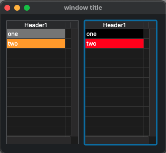

# ListboxFocus
 

To set the color I use [Background Color Expression](https://doc4d.github.io/docs/19/FormObjects/propertiesBackgroundAndBorder#background-color-expression)

4 colors for two boolean values: has focus and is row selected

- After losing the focus the listbox do not refresh and do not call `Background Color Expression`.
- If we refresh in "On Losing Focus" the object has the focus, so it will do not take the no focus color

So a generic solution could be to simulate an `On After Losing Focus` event:
- in `On Losing Focus` launch a timer and keep in a collection the element to refresh
- then in `On Timer` consume the collection of element to refresh and of course refresh it
- to refresh for instance I get the object value and set it again

Code in [Project/Sources/Forms/Form1/method.4dm](Project/Sources/Forms/Form1/method.4dm)

PS: no focus lost even if window loose focus, maybe there is a way to fix that

PS2: an other solution could be to refresh all elements than the one that receive `On Getting Focus`, but a lot of things will be refresh for nothing. So maybe a list of element you want to see refreshed.
